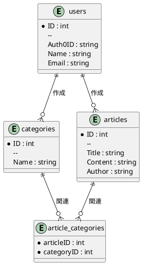
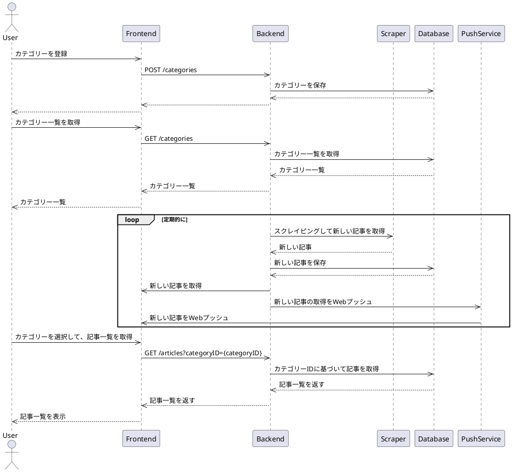

# go-webapp-practice

## 概要

Go での Web アプリケーションの練習用ソースコード。

## 使用技術

※ 今後以下の技術を使って実装。

- フロントエンド: Angular
- バックエンド: Go, Gin, Gorm, golang-migrate
- 認証: Auth0
- その他: SchemaSpy

## セットアップ

### Auth0

1. Auto0 でテナントを設定し以下を作成
   - SPA
   - API

### 環境変数

.env ファイルを作成し、以下の内容を追加します。

    ```
    // Auth0のドメイン名
    VITE_AUTH0_DOMAIN=your-auth0-domain

    // Auth0のSPAアプリケーションのクライアントID
    VITE_WEBAPP_CLIENT_ID=your-auth0-client-id

    // Auth0のAPIアプリケーションのaudience
    VITE_AUTH0_API_AUDIENCE=your-api-audience
    ```

### フロントエンド

1. `frontend`ディレクトリに移動します。
2. 依存関係をインストールします。

```sh
cd frontend
npm install
```

3. ビルド

```sh
# プロジェクトルートディレクトリの/publicに出力されて、Goのウェブサーバーから公開される
npm run build-watch
```

### バックエンド

1. ルートディレクトリに移動して、依存関係をインストール

```sh
go mod tidy
```

サーバーを起動します。

```sh
go run main.go
```

## 動作確認

[http://localhost:8080/](http://localhost:8080/)にアクセス

## アプリケーション概要

このアプリケーションは、ニュース記事をまとめるためのウェブアプリケーションです。ユーザーは記事を作成、表示、更新、削除することができます。フロントエンドはAngularで構築されており、バックエンドはGoで実装されています。

## ER図



## シーケンス図

